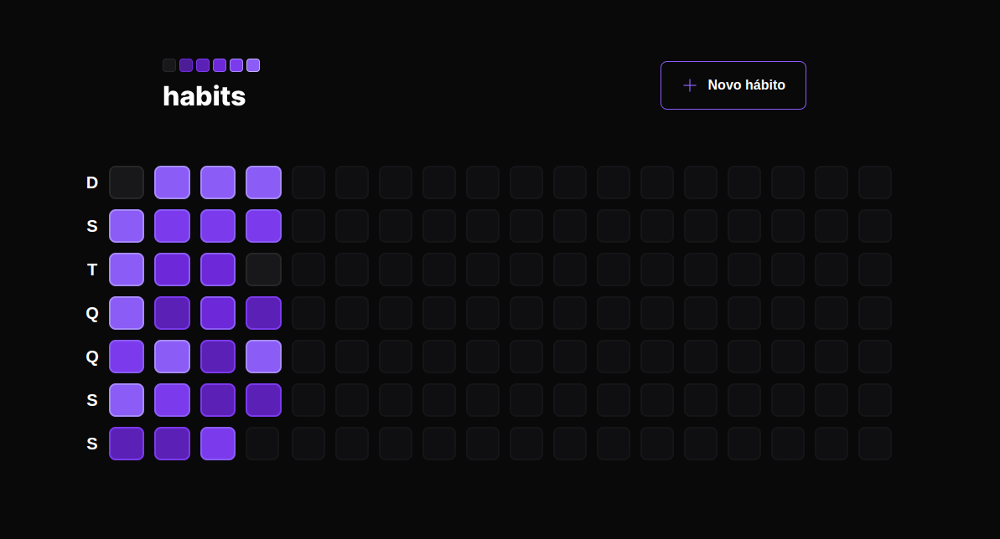
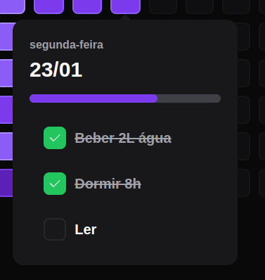
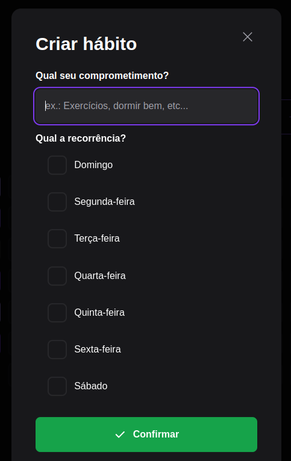

  <a href="#-tecnologias">Tecnologias</a>&nbsp;&nbsp;&nbsp;|&nbsp;&nbsp;&nbsp;
  <a href="#-projeto">Projeto</a>&nbsp;&nbsp;&nbsp;|&nbsp;&nbsp;&nbsp;
  <a href="#-como-rodar">Como rodar</a>&nbsp;&nbsp;&nbsp;|&nbsp;&nbsp;&nbsp;
  <a href="#-como-contribuir">Como contribuir</a>&nbsp;&nbsp;&nbsp;
  

 

## NLW Setup - Habit

## 🚀 Tecnologias

Esse projeto foi desenvolvido com as seguintes tecnologias:

- [React](https://pt-br.reactjs.org/)
- [TypeScript](https://www.typescriptlang.org/)

## 💻 Projeto

Font-end WEB em React do projeto feito no NLW Setup. É um projeto para crair habitos diarios.

- [API](https://github.com/jamangueira7/app-habitos-nodejs-nlw-setup)
- [Mobile](https://github.com/jamangueira7/app-habitos-react-native-nlw-setup)

  

  

  

## 🚀 Como Rodar

- Clone o projeto.
- Entre na pasta do projeto e rode npm install (pode usar yarn install de acordo com a sua configuração).
- Rodar npm run dev.

- npm run dev para rodar o projeto (localhost:3333).

## 🤔 Como contribuir

- Faça um fork desse repositório;
- Cria uma branch com a sua feature: `git checkout -b minha-feature`;
- Faça commit das suas alterações: `git commit -m 'feat: Minha nova feature'`;
- Faça push para a sua branch: `git push origin minha-feature`.

Depois que o merge da sua pull request for feito, você pode deletar a sua branch.

## 📝 Licença

Esse projeto está sob a licença MIT.
